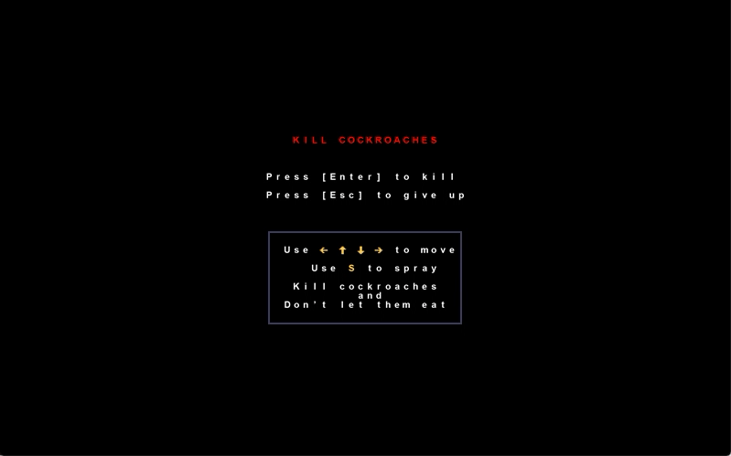

# Roguelike game "Kill Cockroaches"



The goal of the game is to kill all cockroaches on a map. Good luck with that.
Picking up insect sprays can help kill them faster.

## Architecture

All visible objects on the screen are `Nodes`, which have a state and drawing logic. The `Nodes` belong to a `Scene` which is responsible for handling user events, changing `Nodes` state, `Nodes` and child `Scenes` layout.

### Event Handling

Event handling starts with leaf `Scene` which whether handle them themselves or delegate them to parent `Scene` (which passes it down to the next sibling `Scene` if available).

## Installation

```bash
# python >= 3.7
pip install -r requirements
```

## Run

```
python run_game.py
```
To change game parameters you can rewrite config files in `supplementary_materials`.

## Acknowledgment
* https://rogueliketutorials.com/tutorials/tcod/v2/
* http://www.roguebasin.com/index.php?title=Complete_Roguelike_Tutorial,_using_python%2Blibtcod